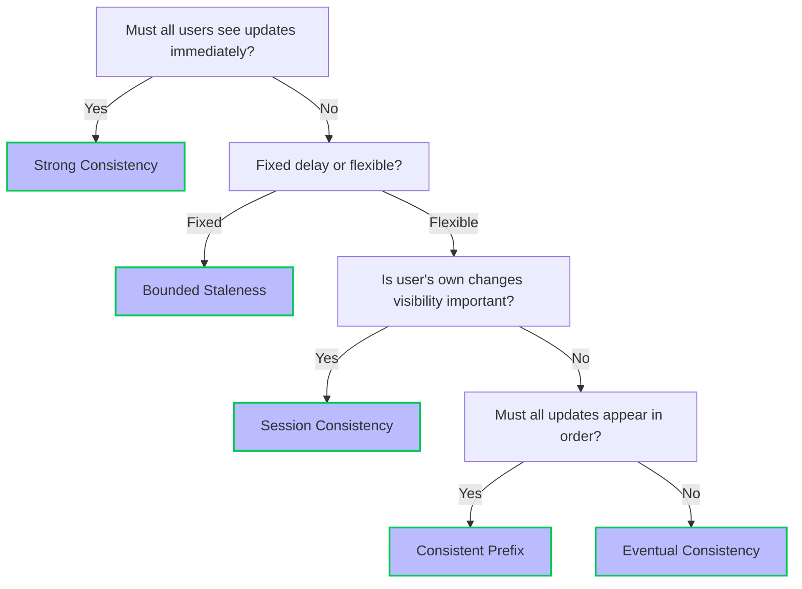

For an elaborate explanation, see the official [docs](https://learn.microsoft.com/en-us/azure/cosmos-db/consistency-levels), which contain this image, but without further explanation it is a bit enigmatic.

In this blog post we explore how you should pick the correct middle ground.

**Immediate Consistency vs. Flexibility in Data Updates**

At the heart of this decision is a question about user experience: **Must all users see updates immediately?** If your application requires that every user sees the most recent data as soon as it's updated—think financial transactions or real-time inventory management—then **Strong Consistency** is the way to go. This level ensures that every read receives the most recent write, guaranteeing an up-to-date view of the data at the expense of higher latency and reduced availability in some scenarios.

However, if your application can function correctly even if users don't see updates immediately, you have more flexibility. This leads to the next consideration: **Fixed delay or flexible?**

**Balancing Delay and Data Freshness**

For applications where a predictable, fixed delay in data updates is acceptable, **Bounded Staleness** offers a compromise. This consistency level allows reads to lag behind writes by a specified time or number of versions, making it suitable for scenarios where slightly outdated data is not critical.

On the other hand, if your application demands flexibility in how data staleness is handled, further questions help refine the choice. One such question is: **Is user's own changes visibility important?** If it's crucial for users to immediately see their own updates—a common requirement in user profile settings or personal dashboards—**Session Consistency** provides the perfect balance. It ensures that within a session, all reads will reflect the user's own writes, offering a personalized and consistent experience.

**Ordering and Performance Considerations**

If the visibility of a user's changes isn't a primary concern, the next decision point focuses on the order of updates: **Must all updates appear in order?** For applications where the sequence of data updates matters (for example, a moderated comment section where the order of comments is significant), **Consistent Prefix** guarantees that reads will reflect writes in the order they were made, without necessarily being the most recent version.

Finally, if your application prioritizes performance and availability over the immediate consistency of data, and the order of updates is not a concern, **Eventual Consistency** is the most suitable choice. This level ensures that all updates will eventually propagate throughout the system, maximizing availability and performance while minimizing latency.
