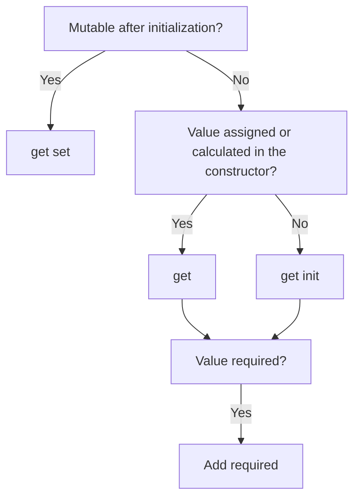

## 2. Choosing the property modifiers

Property setters in C# play a crucial role in defining how you can interact with class and record members. The `set`, `init`, and `get`-only accessors offer different levels of mutability and initialization control, crucial for both mutable and immutable object design. There are a couple of options out there, which one should you choose?

| Optional | Required |
| --- | --- |
| `public string Name { get; }` | `public required string Name { get; }` |
| `public string Name { get; set; }` | `public required string Name { get; set; }` |
| `public string Name { get; init; }` | `public required string Name { get; init; }` |

### Mutable Properties with `set`

The `set` accessor allows properties to be changed at any point in an object's lifetime. It's commonly used in classes where mutability is a requirement.

```csharp
public class Person
{
    public string Name { get; set; }
}

// Initialization and mutation
var person = new Person { Name = "Alice" };
person.Name = "Bob"; // Property can be changed after initialization
```

However, records also support this but is generally considered an **anti-pattern**.

```csharp
public record Person
{
    public string Name { get; set; }
}

var mutablePerson = new MutablePerson { Name = "Alice" };
mutablePerson.Name = "Bob"; // The Name property can be changed after initialization
```

### Immutable Properties with `init`

The `init` accessor, introduced in C# 9.0, is designed for scenarios where you want to allow property values to be set at the time of object creation but remain immutable afterward.

```csharp
public [class|record] Person
{
    public string Name { get; init; }
}

// Initialization
var immutablePerson = new Person { Name = "Alice" };
// immutablePerson.Name = "Bob"; // This line would result in a compile-time error
```

### Read-Only Properties with `get`

Defining a property with only a `get` accessor makes it read-only. This is useful for both computed properties and ensuring that a property remains unchanged after the object's construction.

```csharp
public [class|record] Person
{
    public string Name { get; }

    public Person(string name)
    {
        Name = name;
    }
}

// Initialization
var readOnlyPerson = new PersonWithReadOnlyProperty("Alice");
// readOnlyPerson.Name = "Bob"; // Not allowed
```

### Required Properties with `required`

The `required` keyword ensures that certain properties must be initialized during object creation, enhancing compile-time checks. It's applicable to both classes and records.

```csharp
public [class|record] Person
{
    public required string Name { get; init; }
}

// Initialization
var requiredPerson = new Person { Name = "Alice" };

// This attempt will fail to compile

var personWithoutName = new Person(); // Compile-time error
```

### Conclusion



-   **Mutable vs. Immutable**: Use `set` for mutable properties in classes. Opt for `init` in records (and classes when appropriate) for immutable properties.
-   **Initialization Control**: `init` allows properties to be set at initialization time, perfect for immutable data patterns. `required` ensures all necessary properties are initialized.
-   **Read-Only Properties**: Use `get`-only for properties that should not change after an object is constructed, suitable for computed properties or fixed values.
