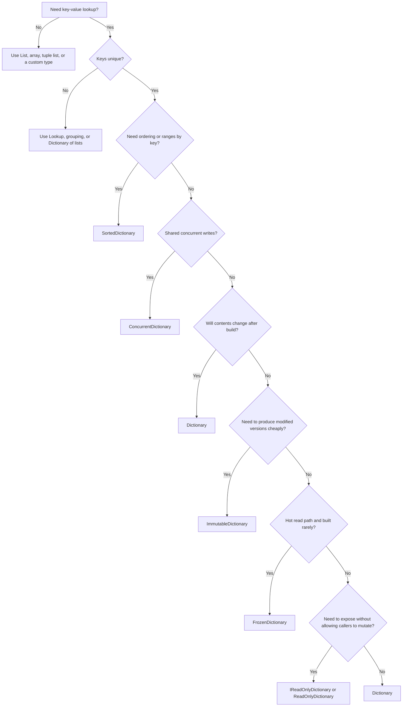

I recently discovered `FrozenDictionary<TKey,TValue>`. The name sounds like a slightly stricter `ReadOnlyDictionary<TKey,TValue>`, but that is not the useful mental model.

The useful model is this:

-   `Dictionary<TKey,TValue>` is the default mutable hash map.
-   `ReadOnlyDictionary<TKey,TValue>` is a read-only wrapper over another dictionary.
-   `ImmutableDictionary<TKey,TValue>` is a persistent collection: updates return a new collection while sharing structure.
-   `FrozenDictionary<TKey,TValue>` is a read-optimized immutable collection: expensive enough to build that you should build it rarely, but fast to query.
-   `ConcurrentDictionary<TKey,TValue>` is for shared mutation from multiple threads.

## The Flowchart

## Criteria

| Scenario | Choose | Why |
| --- | --- | --- |
| Normal add, update, remove, lookup | `Dictionary<TKey,TValue>` | Fast, simple, idiomatic default. Set capacity if you know the size. |
| Public API should not mutate your collection | `IReadOnlyDictionary<TKey,TValue>` or `ReadOnlyDictionary<TKey,TValue>` | Communicates read-only access. Remember: a wrapper is not a deep immutable copy. |
| Many readers, shared writers | `ConcurrentDictionary<TKey,TValue>` | Built for concurrent access and atomic operations such as `AddOrUpdate`. |
| Data built once and queried heavily | `FrozenDictionary<TKey,TValue>` | Optimizes the internal representation for lookups after construction. |
| Functional/persistent update model | `ImmutableDictionary<TKey,TValue>` | `Add` and `Remove` return new dictionaries while sharing structure. |
| Sorted enumeration or range-like key work | `SortedDictionary<TKey,TValue>` | Maintains key order, trading away raw hash-map speed. |
| Legacy non-generic object keys | Avoid `Hashtable` | Prefer generic dictionaries unless you have legacy interop constraints. |
| Duplicate logical keys | Not a dictionary | Use grouping, `Lookup<TKey,TValue>`, or `Dictionary<TKey,List<TValue>>`. |

## The Frozen vs Immutable Trap

The confusing part is that both frozen and immutable collections cannot be changed in place.

That does not make them interchangeable.

`ImmutableDictionary<TKey,TValue>` is optimized for creating changed versions of a collection without copying the whole thing every time. Stephen Toub describes this as the persistent data structure scenario: the collection instance is immutable, but your logical workflow may still keep producing new versions through `Add`, `Remove`, and similar operations.

`FrozenDictionary<TKey,TValue>` is the opposite trade-off. It has no mutation-looking API. You build it, it analyzes the data, and it chooses an internal lookup strategy. That makes sense for long-lived maps such as routing tables, schema metadata, code-to-handler maps, keyword maps, and configuration-derived lookup tables that are rebuilt rarely.

Use `FrozenDictionary` when all of these are true:

-   The data is stable after construction.
-   Reads dominate construction cost.
-   The lookup is on a hot enough path to matter.
-   You benchmarked with your key type and comparer.

Do not use it just because you want to prevent mutation. If the dictionary is small or not hot, a normal `Dictionary` exposed as `IReadOnlyDictionary` is often the clearest option.

## Benchmark

I added a small BenchmarkDotNet project here:

`/assets/posts/choosing-a-csharp-dictionary/benchmark/`

It targets `.NET 10` because that is what is installed on my machine. The original `FrozenDictionary` type arrived in .NET 8, but these numbers are from .NET 10.0.5 on an Apple M4.

The lookup benchmark performs 10,000 successful `TryGetValue` calls against string keys in randomized order:

| Method | Mean | Ratio |
| --- | ---: | ---: |
| `FrozenDictionary_TryGetValue` | 45.38 us | 0.66 |
| `ConcurrentDictionary_TryGetValue` | 60.81 us | 0.89 |
| `Dictionary_TryGetValue` | 68.90 us | 1.00 |
| `ReadOnlyDictionary_TryGetValue` | 71.48 us | 1.04 |
| `ImmutableDictionary_TryGetValue` | 665.74 us | 9.70 |

For this string-key scenario, `FrozenDictionary` was about one third faster than `Dictionary`. `ImmutableDictionary` was much slower for lookup, which is expected: it solves a different problem.

Construction tells the other half of the story:

| Method | Mean | Ratio | Allocated |
| --- | ---: | ---: | ---: |
| `BuildDictionary` | 121.3 us | 1.00 | 276.43 KB |
| `BuildReadOnlyDictionary` | 139.3 us | 1.15 | 276.47 KB |
| `BuildConcurrentDictionary` | 679.8 us | 5.61 | 1022.32 KB |
| `BuildFrozenDictionary` | 692.6 us | 5.71 | 1102.85 KB |
| `BuildImmutableDictionary` | 1625.9 us | 13.41 | 625.26 KB |

In this run, building a `FrozenDictionary` was about 5.7 times slower than building a `Dictionary`. That is fine if the map lives for a long time and is read a lot. It is wasteful if you rebuild it per request.

## Merging Dictionaries

Merging has a separate decision: define duplicate-key behavior first.

-   First value wins: use `TryAdd`.
-   Last value wins: use the indexer assignment.
-   Duplicate keys are invalid: use `Add` or `ToDictionary` and let it throw.
-   Duplicate keys must be combined: group explicitly.

The benchmark merges four 2,500-entry dictionaries into one 10,000-entry dictionary:

| Method | Mean | Ratio | Allocated |
| --- | ---: | ---: | ---: |
| `ForEach_Indexer_LastWins` | 173.6 us | 0.99 | 276.43 KB |
| `ForEach_TryAdd_FirstWins` | 176.2 us | 1.01 | 276.43 KB |
| `Linq_Concat_ToDictionary` | 380.9 us | 2.18 | 920.4 KB |
| `Linq_GroupBy_FirstWins` | 1089.0 us | 6.23 | 2114.16 KB |

This matches the usual Code Maze result: the boring nested `foreach` loop is fastest and allocates least. LINQ is fine for small, cold paths. For large merges or hot paths, write the loop and make the duplicate rule visible.

## Rules of Thumb

-   Start with `Dictionary<TKey,TValue>`.
-   Use `TryGetValue` for lookup when a key might be absent.
-   Use `TryAdd`, `Add`, or indexer assignment based on duplicate-key semantics.
-   Use `StringComparer.Ordinal` or `OrdinalIgnoreCase` for non-linguistic string keys.
-   Pre-size dictionaries when you know the count.
-   Expose `IReadOnlyDictionary<TKey,TValue>` when callers should not mutate.
-   Reach for `FrozenDictionary<TKey,TValue>` only when stable data sits on a hot read path.
-   Reach for `ImmutableDictionary<TKey,TValue>` only when you need persistent update semantics.
-   Reach for `ConcurrentDictionary<TKey,TValue>` only when concurrent mutation is part of the design.

## Sources

-   [Dictionary in C# - Code Maze](https://code-maze.com/dictionary-csharp/)
-   [How to Merge Dictionaries in C#? - Code Maze](https://code-maze.com/csharp-how-to-merge-dictionaries/)
-   [A quick tour of dictionaries in C# - Jack Lewis](https://dev.to/jlewis92/a-quick-tour-of-dictionaries-in-c-gg9)
-   [Performance Improvements in .NET 8 - Stephen Toub](https://devblogs.microsoft.com/dotnet/performance-improvements-in-net-8/)
-   [Frozen compared to Immutable collections in .NET 8 - r/dotnet](https://www.reddit.com/r/dotnet/comments/1eckkbu/frozen_compared_to_immutable_collections_in_net_8/)
