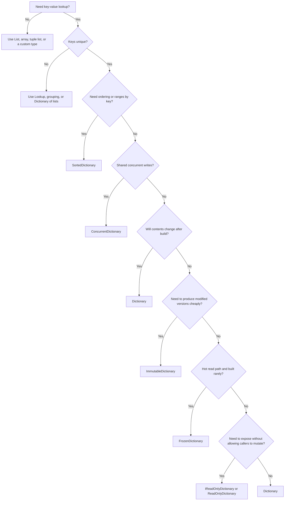

I recently ran into `FrozenDictionary<TKey,TValue>`, which apparently [arrived in .NET 8](https://devblogs.microsoft.com/dotnet/performance-improvements-in-net-8/), and first read it as "a colder `ReadOnlyDictionary`". That's not it though, and the naming is quite confusing.

-   `Dictionary<TKey,TValue>` is the 'normal' general purpose dictionary.
-   `ReadOnlyDictionary<TKey,TValue>` is an adapter around an existing dictionary. Callers will not be able to write.
-   `ImmutableDictionary<TKey,TValue>` is optimized to create cheap modified (mutated) copies (confusing, right).
-   `FrozenDictionary<TKey,TValue>` is optimized for quick reads.
-   `ConcurrentDictionary<TKey,TValue>` is for shared writes from multiple threads.

This gives you the following tradeoffs:

| Type | Strength | Cost / risk | Use when |
| ---- | -------- | ------------|----------|
| `ReadOnlyDictionary<TKey,TValue>` | Cheap wrapper; no copy required | Not truly immutable; backing dictionary can still change | You want to expose a dictionary as read-only and you control the backing dictionary |
| `ImmutableDictionary<TKey,TValue>` | Immutable snapshots; safe sharing; efficient “modified copies” | Slower and more allocation-heavy than `Dictionary` for normal mutation/read-heavy workloads | You need persistent versions, functional updates, or concurrency-safe snapshots |
| `FrozenDictionary&lt;TKey,TValue&gt;` | Very fast lookup/enumeration after construction | Expensive to build; cannot update; intended for trusted stable keys | You build once, then read many times, often for app lifetime |

## ReadOnlyDictionary

`ReadOnlyDictionary<TKey,TValue>` is a wrapper class. You pass it an existing dictionary. The wrapper does not expose `Add`, `Remove`, or a settable indexer, but it reads from the dictionary you gave it. `ReadOnlyDictionary` does not take a defensive copy of the source dictionary.

```csharp
var source = new Dictionary<string, int>
{
    ["BE"] = 32,
    ["NL"] = 31
};

var readOnly = new ReadOnlyDictionary<string, int>(source);

source["LU"] = 352; // <-- we can still modify the underlying source

Console.WriteLine(readOnly["LU"]); // 352
```

So `ReadOnlyDictionary` does not mean "nobody can ever change this data". It means "you cannot change it through this object". Its interface is often used as return type:

```csharp
public IReadOnlyDictionary<string, int> CountryCodes => _countryCodes;
```

That says "you can read this" without promising that nobody inside the class will ever change `_countryCodes`.

## ImmutableDictionary and FrozenDictionary

Both `ImmutableDictionary` and `FrozenDictionary` stop you from changing the object in place. That is where the similarity ends.

`ImmutableDictionary` is a data structure where updates return a new version while sharing most of the old structure. This is common terminology in functional programming, but it is easy to misread in everyday .NET code.

```csharp
var original = ImmutableDictionary<string, int>.Empty
    .Add("BE", 32)
    .Add("NL", 31);

var changed = original.Add("LU", 352);

Console.WriteLine(original.ContainsKey("LU")); // False
Console.WriteLine(changed.ContainsKey("LU"));  // True
```

That is the point of `ImmutableDictionary`: keep `original`, pass `changed`, and do not copy the whole dictionary for each change.

`FrozenDictionary` has a different job. Build it when the data is done changing.

```csharp
var frozen = new Dictionary<string, int>
{
    ["BE"] = 32,
    ["NL"] = 31,
    ["LU"] = 352
}.ToFrozenDictionary(StringComparer.Ordinal);

Console.WriteLine(frozen["NL"]);
```

There is no `Add` method returning a new `FrozenDictionary`. If the data changes, build a new one. The type spends extra work during construction so lookups can be cheaper later.

That makes sense for long-lived maps: route tables, schema metadata, code-to-handler maps, keyword maps, and lookup tables built from configuration. It makes much less sense for something you rebuild every request.

## Benchmarks

The benchmark code is [here](https://github.com/woutervanranst/woutervanranst.github.io/tree/main/docs/assets/posts/choosing-a-csharp-dictionary/benchmark).

### Lookup

The lookup benchmark performs `TryGetValue` calls against string keys in randomized order:

```text
BenchmarkDotNet v0.14.0, macOS 26.5.1, Apple M4
.NET SDK 10.0.201
Runtime=.NET 10.0.5, Arm64 RyuJIT AdvSIMD

| Method                           | Count | Mean      | Ratio | Allocated |
|--------------------------------- |------ |----------:|------:|----------:|
| Dictionary_TryGetValue           | 10000 |  68.90 us |  1.00 |         - |
| ReadOnlyDictionary_TryGetValue   | 10000 |  71.48 us |  1.04 |         - |
| ImmutableDictionary_TryGetValue  | 10000 | 665.74 us |  9.70 |         - |
| FrozenDictionary_TryGetValue     | 10000 |  45.38 us |  0.66 |         - | <-- cheaper vs Dictionary
| ConcurrentDictionary_TryGetValue | 10000 |  60.81 us |  0.89 |         - |
```

For this string-key scenario, `FrozenDictionary` was about one third faster than `Dictionary`. `ImmutableDictionary` was much slower for lookup.

### Construction

Construction tells the other half of the story:

```text
| Method                           | Count | Mean      | Ratio | Allocated  |
|--------------------------------- |------ |----------:|------:|-----------:|
| BuildDictionary                  | 10000 |  121.3 us |  1.00 |  276.43 KB |
| BuildReadOnlyDictionary          | 10000 |  139.3 us |  1.15 |  276.47 KB |
| BuildImmutableDictionary         | 10000 | 1625.9 us | 13.41 |  625.26 KB |
| BuildFrozenDictionary            | 10000 |  692.6 us |  5.71 | 1102.85 KB | <-- more expensive vs Dictionary
| BuildConcurrentDictionary        | 10000 |  679.8 us |  5.61 | 1022.32 KB |
```

In this run, building a `FrozenDictionary` was about 5.7 times slower than building a `Dictionary`. Fine for a map that lives for a while. Wasteful for a throwaway map.

`ImmutableDictionary` is even slower to build from scratch here because it is building the machinery for future snapshots: a persistent structure that can share nodes between versions. `FrozenDictionary` also spends extra construction work, but it spends it on one final lookup table. Neither is trying to beat `Dictionary` at first construction.

### Mutations

Produce a new dictionary-like collection with one extra key:

```text
| Method                           | Count | Mean       | Ratio  | Allocated | Alloc Ratio |
|--------------------------------- |------ |-----------:|-------:|----------:|------------:|
| ImmutableDictionary_Add          | 10000 |   0.202 us |  0.004 |     872 B |       0.003 | <-- MUCH cheaper vs Dictionary
| Dictionary_CopyAndAdd            | 10000 |  55.774 us |  1.005 |  283094 B |       1.000 |
| FrozenDictionary_RebuildAndAdd   | 10000 | 661.273 us | 11.918 | 1129400 B |       3.989 |
```

That is the metric where `ImmutableDictionary` wins: producing another version is cheap. It does not copy 10,000 entries to add one key. It creates a new root and a small number of changed nodes. Most of the old structure is shared.

### Merging dictionaries

If you want to merge a Dictionary, there are several strategies - I refer to [How to Merge Dictionaries in C#? - Code Maze](https://code-maze.com/csharp-how-to-merge-dictionaries/) who does an excellent write-up.

The fastest way turns out to be a nested `foreach` loop wins. LINQ is fine for small, cold paths. For large merges or hot paths, write the loop and make the duplicate rule visible.

## The flowchart


